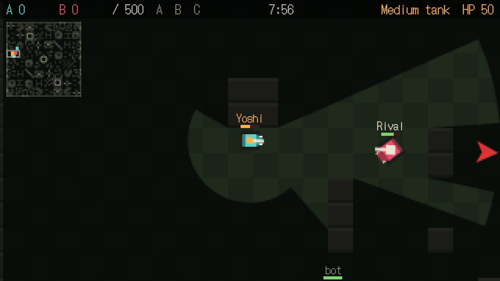
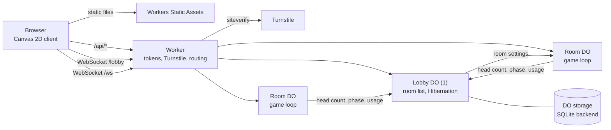

# 💥 FLARE TANKS

[](https://workers.cloudflare.com/)
[](https://developers.cloudflare.com/durable-objects/)
[](https://www.typescriptlang.org/)
[](https://developer.mozilla.org/docs/Web/API/Canvas_API)
[](./LICENSE)

**A real-time 3 vs 3 tank battle for the browser, running entirely on the Cloudflare free plan.**

FLARE TANKS is a top-down 2D pixel-art tank game. Two teams of three fight on a point-symmetric map with fan-shaped vision: what's behind walls stays dark, and the server never tells you where unseen enemies are. Empty slots are filled with bots, so you can play alone or with friends, on a PC or a phone.

👉 **Live demo:** https://flare-tanks.yoshihicode.workers.dev/

## 🎯 About this project

This project is a **sample of building a real-time multiplayer game with Cloudflare Durable Objects**. Rather than a minimal chat demo, it covers what an actual game server needs:

- One Durable Object per room runs an authoritative 20 Hz game loop over WebSockets
- A single lobby Durable Object keeps the room list and uses the **WebSocket Hibernation API**
- Server-side visibility filtering, so hidden information never reaches the client (anti-cheat)
- Bots, matchmaking, invite codes, signed guest tokens and Turnstile, without any login
- Everything designed to run within the **free tier**, including a daily message budget

Feel free to use it as a reference for your own Durable Objects projects. The full design spec (in Japanese) is in [`docs/spec.md`](./docs/spec.md).

## ⚙️ Features

- 🪖 3 vs 3 rooms; empty slots are filled by bots with five difficulty levels.
- 🚜 Three tank types (light / medium / heavy) with different speed, HP, fire rate, field of view and turret speed.
- 🏁 Two modes: **Elimination** (first to 2 rounds, 10 min per round) and **Conquest** (3 capture points, first to 500 pts, 8 min).
- 🔦 Fan-shaped vision plus a short all-around view; walls cast shadows computed by ray casting.
- 🕵️ Unseen enemy gunfire arrives only as a rough direction and distance; pins, hit direction marks and last-seen afterimages help the team.
- 🗺️ Chunk-based generated maps (128×128 tiles, point-symmetric, reproducible from a seed) or a fixed basic map.
- 🏠 Lobby with a live room list, quick join, private rooms with 6-digit invite codes, and kicking.
- 🔁 Reconnect within 30 seconds to get your own tank back from the bot that took it over.
- 📱 Phone support with twin sticks and a light aim assist; installable as a PWA.
- 🔊 Retro sound effects synthesized in the browser (jsfxr-style), panned by direction.
- 🌏 English and Japanese UI.

### 🎮 Controls

| Action | PC | Phone |
| --- | --- | --- |
| Move | WASD / arrow keys | Drag on the left half of the screen |
| Aim (turret and view) | Mouse | Drag on the right half of the screen |
| Fire | Click / Space | Push the right stick far enough |
| Pin ("enemy spotted") | Q | Pin button |
| Players / invite link | Tab | Players button |
| Mute | M | Sound button |
| Start now (room owner, while waiting) | Enter | Start now button |
| Leave the room | Esc | Leave button |

## 🏗️ Architecture



A single Worker is the only entry point:

- **Static files** (the game client) are served by Workers Static Assets without running the Worker code.
- **`/api/*`** issues signed guest tokens, and creates / finds rooms through the lobby after a Turnstile check.
- **`/lobby`** is a WebSocket to the lobby Durable Object, which pushes the room list only when it changes.
- **`/ws`** is a WebSocket to a room Durable Object. The Worker verifies the guest token and Turnstile, then forwards the connection with the guest ID in headers. Rooms are reachable only through the Worker.

Each room Durable Object is the authority for its match: it moves tanks, resolves hits, runs the bots and decides what each player may see. Clients only send input and draw what they receive.

### How each Cloudflare product is used

| Product / feature | What it is used for |
| --- | --- |
| **Workers** | Entry point: guest tokens, Turnstile verification, routing to the lobby and room Durable Objects. |
| **Workers Static Assets** | Serves the client (`public/`): plain JavaScript modules, no build step. |
| **Durable Objects (rooms)** | One instance per room. Holds the game state in memory, runs a 20 Hz loop, and sends each player a snapshot filtered by their own vision. |
| **Durable Objects (lobby)** | One instance. Keeps the room list, invite codes, per-IP creation limits and the daily message counter. |
| **WebSocket Hibernation API** | Lets the lobby sleep between list changes, so watchers don't use the free duration budget. |
| **Durable Objects storage (SQLite backend)** | Persists the lobby's room list across hibernation, and a room's settings between creation and the first join. Required on the free plan. |
| **Durable Objects alarms** | Periodically removes rooms nobody joined and rooms that stopped reporting. |
| **Turnstile** | Checks for automated clients when creating, quick-joining and joining a room. |

### Design notes

- 🛡️ **Server-authoritative.** Movement, hits, damage and vision are all computed in the room. The client predicts its own tank with the same shared code (`public/shared.js`) and is corrected by the server.
- 🙈 **Hidden information is never sent.** Enemies and bullets outside your view are filtered out of your snapshot; unseen gunfire is reduced to a 16-way direction and a near / mid / far bucket.
- 💰 **Few incoming messages, many outgoing.** Incoming WebSocket messages count toward the request limit, outgoing ones are free. Clients send input only when it changes (at most every 50 ms); the server sends 20 snapshots per second; bots run inside the room and send no messages.
- 😴 **Nothing idles in memory.** The lobby hibernates; a room runs its loop only while people are in it (plus a 30-second reconnect window) and then stops.
- 🔑 **Guest identity without login.** Tokens are HMAC-SHA256 signed by the server. The Worker refuses to serve without its secrets instead of falling back to unsafe defaults.
- ⚖️ **Fair maps.** Every map is point-symmetric. Generated maps are checked for connectivity, at least three disjoint routes between capture points (max flow), and a reasonable amount of cover.
- 🌐 **Language on the client.** The server sends error codes, not sentences, so players with different languages can share a room.

## 📁 Project structure

```
flare-tanks/
├── wrangler.jsonc          # Durable Object bindings (Room, Lobby) and SQLite migrations
├── package.json            # dev / deploy / test:smoke scripts (dev sets local-only vars)
├── docs/spec.md            # Design spec (Japanese)
├── src/                    # Worker and Durable Objects (TypeScript, bundled by Wrangler)
│   ├── index.ts            # Worker routes and the Room Durable Object (game loop, vision, modes)
│   ├── lobby-do.ts         # Lobby Durable Object (room list, create, quick join, invite codes)
│   ├── lobby.ts            # Lobby rules as pure functions (quick join order, cleanup, limits)
│   ├── bot.ts              # Bot AI: A* paths, state machine, five levels, objective sharing
│   ├── maps.ts             # Map type and the basic 40x24 map
│   ├── mapgen.ts           # Chunk-based 128x128 map generation and validation
│   ├── chunks.ts           # Hand-made 16x16 map parts
│   ├── settings.ts         # Room settings validation
│   ├── guest.ts            # Guest tokens (HMAC-SHA256) and name checks
│   ├── turnstile.ts        # Turnstile verification
│   ├── errors.ts           # Error codes returned by the server
│   └── env.ts              # Binding types
├── public/                 # Client, served as static assets (plain JavaScript modules)
│   ├── index.html          # Title, lobby and settings screens
│   ├── game.js             # Rendering, input, networking, sound
│   ├── shared.js           # Code shared with the server: movement, line of sight, vision, tank stats
│   ├── i18n.js             # English / Japanese text
│   ├── touch.js            # Twin-stick controls
│   ├── interp.js           # Interpolation buffer for other tanks
│   ├── minimap.js          # Minimap
│   ├── ghosts.js           # Last-seen afterimages
│   ├── sfx.js              # Sound effect synthesizer and presets
│   └── sw.js, manifest.json, icons/   # PWA
└── scripts/
    ├── smoke-test.mjs      # End-to-end test against the dev server
    ├── bot-checks.mjs      # Bot behavior checks (no server needed)
    └── make-icons.mjs      # Generates the PWA icons
```

## 📋 Prerequisites

- Node.js 22.18 or later (the smoke test imports TypeScript files directly)
- A Cloudflare account (the free plan is enough) — only needed to deploy
- A Turnstile widget in the Cloudflare dashboard — only needed to deploy

## 🛠️ Setup

### 1. Clone and install

```bash
git clone https://github.com/yoshihicode/flare-tanks.git
cd flare-tanks
npm install
```

### 2. Start the development server

```bash
npm run dev
```

`npm run dev` passes local-only values to Wrangler, so no secrets or `.dev.vars` file are needed for local development:

| Variable | Local value |
| --- | --- |
| `GUEST_SECRET` | A fixed development-only string |
| `TURNSTILE_SITEKEY` / `TURNSTILE_SECRET` | Cloudflare's [test keys](https://developers.cloudflare.com/turnstile/troubleshooting/testing/) that always pass |
| `DEBUG_TOOLS` | `1`: enables ad-hoc rooms and debug commands (see below) |

### 3. Play

Open http://localhost:8787 in two browser tabs (or two browsers) to play against each other. Enter a name, pick a tank and you are in the lobby: use **Quick join**, **Create room**, or join with an invite code. Bots fill the remaining slots, so one tab is enough to play against bots.

To invite someone, open the players list with Tab (or the Players button) and copy the invite link.

### 4. Run the smoke test

With the dev server running, in another terminal:

```bash
npm run test:smoke
```

It takes about 20 seconds and runs about 150 checks: several rooms and the lobby are exercised in parallel (shooting, vision filtering, bots, both modes, pins, gunfire hints, settings, guests, reconnects, Turnstile, limits, generated maps), plus offline checks of the bots, map generator, touch controls, sounds, PWA files and translations.

## 🧪 Local development tips

- Skip the lobby with a dev-only ad-hoc room. The first player's URL decides the settings:

  ```
  http://localhost:8787/?room=test&mode=conquest&bot=5&map=random&seed=777
  ```

  Parameters: `mode` (`elim` / `conquest`), `bot` (1–5), `rounds` (1–3), `ff=1` (friendly fire), `map` (`basic` / `random`), `seed`. Ad-hoc rooms are refused in production.

- Debug commands (dev only) are WebSocket messages like `{"t":"dbg","freezeBots":true}`. The smoke test uses them to freeze bots, skip timers, teleport, set scores and HP, and read the tick time (`{"t":"dbg","stats":true}`).
- Gameplay numbers are kept in one place each (see [Configuration](#️-configuration)), so balance changes don't touch the logic.
- Regenerate the PWA icons after changing the pixel art in `scripts/make-icons.mjs`:

  ```bash
  node scripts/make-icons.mjs
  ```

- When adding a client file, add it to `SHELL` in `public/sw.js`; the smoke test fails if a module imported by `game.js` is missing there.

## ⚙️ Configuration

### Secrets and variables

| Name | Where | Description |
| --- | --- | --- |
| `GUEST_SECRET` | secret | Key for signing guest tokens (a long random string) |
| `TURNSTILE_SITEKEY` | secret or var | Turnstile site key, sent to the browser |
| `TURNSTILE_SECRET` | secret | Turnstile secret key |
| `DEBUG_TOOLS` | `npm run dev` only | `1` enables ad-hoc rooms and debug commands. Never set it in production |

Without `GUEST_SECRET`, `TURNSTILE_SITEKEY` and `TURNSTILE_SECRET`, the Worker refuses `/ws`, `/lobby` and `/api/*`.

### Gameplay and limits

| What | Where |
| --- | --- |
| Tank stats (speed, HP, fire rate, damage, view, turret speed) | `TANK_TYPES` in `public/shared.js` |
| Match timing (waiting, countdown, round length) | `MATCH` in `src/index.ts` |
| Conquest rules (target, capture time, zone size, respawn) | `CONQUEST` in `src/index.ts` |
| Bot levels (reaction, aim error, tactics) and behavior | `BOT_LEVELS` and `BOT` in `src/bot.ts` |
| Map generation rules | `GEN` in `src/mapgen.ts` |
| Lobby limits (room creation per IP, daily message budget) | `LOBBY` in `src/lobby.ts` |
| Room setting options and defaults | `src/settings.ts` |

## 🚀 Deployment

### 1. Create a Turnstile widget

`TURNSTILE_SITEKEY` and `TURNSTILE_SECRET` are not values you make up: they are issued by Cloudflare when you create a Turnstile widget.

1. In the Cloudflare dashboard, open **Turnstile** and add a widget.
2. Under **Hostname Management**, add the hostname the game will be served from:
   - `<your-subdomain>.workers.dev` for the default Workers URL. Adding a hostname also allows all of its subdomains, so this covers `flare-tanks.<your-subdomain>.workers.dev`.
   - Or your own domain, if you use a custom domain.

   Enter the hostname only (no `https://`, port or path). The game doesn't need to be deployed yet.
3. Choose **Managed** as the widget mode. The game renders the widget with `appearance: interaction-only`, so it only shows up when Cloudflare wants the player to interact.
4. Create the widget and copy the two keys it shows:

| Widget key | Set it as | Notes |
| --- | --- | --- |
| Site Key | `TURNSTILE_SITEKEY` | Public: it is sent to the browser |
| Secret Key | `TURNSTILE_SECRET` | Keep it secret: used by the Worker to verify tokens |

If you don't know your `workers.dev` subdomain yet, you can deploy first (step 2 without the Turnstile secrets): the deploy succeeds and prints the URL, and the game answers "Server not configured" until the secrets are set.

### 2. Register the secrets and deploy

```bash
npx wrangler login
npx wrangler secret put GUEST_SECRET        # e.g. output of: openssl rand -hex 32
npx wrangler secret put TURNSTILE_SITEKEY   # the widget's Site Key
npx wrangler secret put TURNSTILE_SECRET    # the widget's Secret Key
npm run deploy
```

For local development none of this is needed: `npm run dev` uses Cloudflare's always-pass test keys.

The game will be available at `https://flare-tanks.yoshihicode.workers.dev`. The Durable Object classes are created from the `migrations` in `wrangler.jsonc` (`new_sqlite_classes`, required on the free plan).

Watch the logs with:

```bash
npx wrangler tail
```

## 💰 Free tier notes

- Durable Objects on the free plan allow 100,000 requests and 13,000 GB-s of duration per day. Incoming WebSocket messages count as one request per 20 messages; outgoing messages are free.
- That is about 2 million incoming messages a day. Six humans sending about 10 inputs per second use it up in roughly 9 hours of play; bots don't count.
- Rooms report their incoming message count to the lobby, which refuses new rooms once today's total passes 80% of the budget. Existing rooms keep running.
- A running room stays in memory for the whole match (the game loop never sleeps), so duration is the other limit to watch. The lobby uses hibernation to avoid adding to it.
- Limits reset at 00:00 UTC. On the free plan, exceeding a limit results in errors, not charges.

Free tier limits may change. Check the [Durable Objects pricing](https://developers.cloudflare.com/durable-objects/platform/pricing/) and limits pages before relying on these numbers.

## 🧩 Known limitations

- Tanks pass through each other (no tank-to-tank collision).
- The generated 128×128 map is large for 3 vs 3; crossing it takes a heavy tank about 50 seconds.

## 📄 License

[MIT](./LICENSE)
