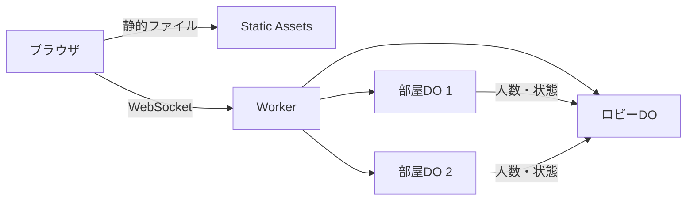
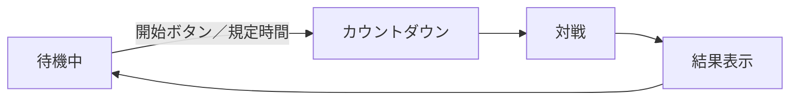

# FLARE TANKS 仕様書（Cloudflare無料枠）

最終更新：2026-09-25

## 概要

FLARE TANKS（フレアタンクス）は、Cloudflareの無料枠だけで動く、ブラウザ向けのトップビュー2D戦車対戦ゲームです。3vs3のチーム戦で、足りない人数はbotが補います。

| 項目 | 内容 |
| --- | --- |
| ジャンル | トップビュー2D戦車シューティング |
| 見た目 | ドット絵のレトロ風。サウンドエフェクトあり |
| 人数 | 1部屋6人（3vs3）。不足分はbot |
| モード | 拠点制圧／殲滅（部屋作成者が選択） |
| 視界 | 扇形視界＋近距離の全周視界。障害物の裏はレイキャスティングで見えない |
| 対応端末 | PCブラウザ、スマホブラウザ（横画面） |
| プレイヤー識別 | ゲスト方式（名前入力のみ） |
| 運用費 | Cloudflare Workers無料プランの範囲内 |

## システム構成

ゲームの判定はすべてサーバー側で行う「サーバー権威型」とし、1部屋を1つのDurable Object（DO）で管理します。

| 役割 | サービス | 内容 |
| --- | --- | --- |
| フロント配信 | Workers Static Assets（またはPages） | Canvas 2D描画、ドット絵、SE |
| APIの入口 | Workers | WebSocket接続の振り分け、Turnstile検証、トークン発行 |
| ロビー | ロビー用DO（1つ） | 部屋一覧の管理と配信、クイック参加の割り当て |
| 対戦 | 部屋用DO（部屋ごと） | ゲームループ、当たり判定、視界判定、bot、スナップショット送信 |
| bot対策 | Turnstile | 部屋の作成・参加時に自動プログラムを判定 |
| 戦績（将来） | D1 | ログイン導入時に利用。初期は使わない |

部屋DOは状態が変わるたびに、人数や状態をロビーDOへ通知します。

## 無料枠の試算

人間6人の3vs3でも、1日約9時間の対戦が可能な見込みです。数値は2026年9月時点の公式料金ページに基づく試算です（[Durable Objects Pricing](https://developers.cloudflare.com/durable-objects/platform/pricing)）。

| 項目 | 無料プランの上限 | 本ゲームでの消費 |
| --- | --- | --- |
| DOリクエスト | 10万件/日 | 受信WebSocketメッセージは20件で1件換算。送信メッセージは無料 |
| DO実行時間 | 13,000 GB-s/日 | 対戦中はゲームループで休眠しない。128MB換算で1部屋あたり約28時間/日 |
| 超過時 | 同種の処理がエラーになる | 日次上限は00:00 UTC（日本時間9:00）にリセット |

受信メッセージの試算は次のとおりです。

- 上限：10万件 × 20 ＝ 約200万メッセージ/日
- 人間6人 × 毎秒10回 ＝ 毎秒60件 → 約33,000秒 ＝ 約9時間/日
- botはサーバー内で動くため、受信メッセージを消費しない

設計方針：入力はクライアントから少なく（変化時のみ送信）、状態はサーバーから多く送る。メッセージ数の簡易カウンタを用意し、上限に近づいたら新規部屋の作成を止める。

## ゲームモード

部屋作成者が「拠点制圧」か「殲滅」を選びます。モードは待機中のみ変更でき、対戦中は固定です。

| | 拠点制圧 | 殲滅 |
| --- | --- | --- |
| 復活 | あり（自陣で5秒後） | なし（ラウンド制） |
| 勝利条件 | 制圧ポイントが先に500へ到達（制限時間8分） | 相手を全滅させる。2ラウンド先取（最大3ラウンド）。1ラウンドの制限時間は10分 |
| 時間切れ | ポイントが多い側の勝ち | 残りHP合計が多い側の勝ち |
| 途中参加 | 即参加（botと交代） | 次のラウンドから参加 |
| 観戦 | なし | 待機中は自チームの視点のみ観戦可 |

**拠点制圧のルール**

- 拠点は3か所（A・B・C）。Cはマップ中央、A・Bは点対称の位置に置く
- 範囲内に自チームだけがいると制圧が進む。敵味方が両方いると「競合中」で停止する
- 制圧中の拠点1か所につき毎秒1ポイント加算される（2か所で約4分10秒、1か所では8分以内に届かない）

殲滅モードの観戦を自チーム視点に限定するのは、敵の位置を味方に流すことを防ぐためです。

## 戦車3種

性能は設定ファイル（JSON）で管理し、試遊しながら調整します。下表は初期値の案です。

| 項目 | 軽戦車 | 中戦車 | 重戦車 |
| --- | --- | --- | --- |
| 役割 | 偵察・拠点奪取 | 万能 | 拠点防衛・撃ち合い |
| 移動速度（相対） | 1.5 | 1.0 | 0.6 |
| 連射間隔 | 0.25秒 | 0.6秒 | 1.2秒 |
| 弾ダメージ | 10 | 25 | 50 |
| HP | 60 | 100 | 160 |
| 視野角 | 約120° | 約90° | 約60° |
| 視界距離 | 長い | 中 | 中 |
| 砲塔旋回速度 | 速い | 中 | 遅い |

重戦車は「火力はあるが側面を突かれやすい」弱点を持ちます。砲塔旋回速度の上限は、マウスとスマホ操作の照準差を縮める効果もあります。

## 視界システム

視界は各自が見えている範囲のみで、チーム内では共有しません。見えない敵の座標はサーバーから送らないことで、通信を覗くチートを防ぎます。

| 要素 | 内容 |
| --- | --- |
| 扇形視界 | 砲塔の向き方向。視野角と距離は戦車ごとに異なる |
| 近距離の全周視界 | 車体周囲の半径2〜3タイルは全方位が見える |
| 障害物 | 壁の角へレイを飛ばして可視ポリゴンを作り、範囲外を暗くする |
| 味方 | 位置は常に表示（誤射・合流ミス防止） |
| 敵弾 | 自分の視界に入った時点から表示 |

**サーバー側の判定**：可視ポリゴンは作らず、戦車同士の「角度判定＋見通し線判定」のみ行います。6台なら30組のチェックで済みます。描画用の可視ポリゴンはクライアントだけで作ります。

**視界を補う要素**

- 発砲音の方向ヒント：見えない敵の発砲を、方向と大まかな距離だけ音で伝える（正確な座標は送らない）
- 最後に見た位置の残像：視界から消えた敵を半透明で残す（クライアントのみで処理）
- ピン機能：「敵発見」マーカーを味方に共有する
- 被弾方向インジケーター：撃たれた方向を画面端に表示する

## マップ

初期は固定マップで始め、後からチャンク組み合わせ型の自動生成を追加します。どちらの方式でも、両チームの条件をそろえるため点対称を必須とします。

| 項目 | 内容 |
| --- | --- |
| サイズ | 1タイル16px、128×128タイル（画面の約40枚分） |
| 画面 | 320×180の表示範囲をカメラが自機に追従してスクロール |
| ミニマップ | 味方と既知の敵のみ表示 |
| データ | 開始時に1回だけ送信。以降は差分のみ |
| 拠点マーカー | マップデータに保持。殲滅モードでは無視する |

**段階的な方針**

1. 初期：マップエディタ（Tiledなど）で固定マップを2〜3枚作り、JSONで読み込む
2. 後期：16×16タイルの部品を十数個手作りし、マップの半分をランダムに埋めてから180°回転で複製する

**自動生成の条件**

- 塗りつぶし探索で全エリアがつながっていることを確認する
- 拠点間に最低3本の経路を確保する
- 扇形視界が活きるよう、遮蔽物を適度に配置する
- シード値を保存すれば同じマップを再現できる

## bot

人間が足りない枠をbotで埋め、常に3vs3を保ちます。botは部屋DO内で動き、プレイヤーと同じ入力形式・同じ視界判定を使います。

| 場面 | 動作 |
| --- | --- |
| 開始時 | 待機時間（例：30秒）後、不足分をbotで埋めて開始 |
| チーム分け | 人間を両チームに均等に振り分け、残りをbotで埋める |
| 途中参加 | 人間がbotの枠を引き継ぐ |
| 切断 | 切断した人間の戦車をbotが引き継ぐ |
| 人間が0人 | 部屋を閉じてDOを停止する |

**行動ロジック**

- 共通：状態遷移（巡回 → 発見 → 追跡・射撃 → HP低下で退避）、経路探索はタイル上のA*
- 拠点制圧：拠点へ向かう・守る行動を優先
- 殲滅：巡回・待ち伏せ・追跡を優先
- 視界：扇形視界のため、巡回中は周囲を見回す動作を入れる。壁越しに敵を知ることはない

**難易度**：部屋作成者が5段階から選びます（既定はレベル3）。どのレベルでも、壁越しに敵を知る不正な視界は持ちません。

| レベル | 名称 | 反応の速さ | 照準の精度 | 戦術 |
| --- | --- | --- | --- | --- |
| 1 | 入門 | 遅い | ぶれが大きい | 単純に接近して撃つ |
| 2 | 初級 | やや遅い | ぶれがやや大きい | 被弾すると退避する |
| 3 | 標準 | 普通 | 普通 | 待ち伏せ・拠点防衛を行う |
| 4 | 上級 | 速い | 正確 | 側面・背後に回り込む |
| 5 | 達人 | とても速い | とても正確 | ピンで味方botと連携し、挟み撃ちを狙う |

## ロビーと部屋

部屋作成者がモードと設定を決め、他のプレイヤーはその部屋に参加します。対戦後も部屋は残り、同じメンバーで連戦できます。

| 機能 | 内容 |
| --- | --- |
| 部屋一覧 | 公開部屋のモード・人数・状態（待機中／対戦中）を表示 |
| 部屋作成 | モード・マップ・ラウンド数・フレンドリーファイア（味方への誤射ダメージ）の有無・botの強さ（5段階）を作成者が設定 |
| クイック参加 | 空きのある公開部屋に自動で入る。なければ新規作成 |
| 招待コード | 非公開部屋に6桁コードまたはURLで参加 |
| 追放 | 作成者が迷惑なプレイヤーを部屋から外せる |

**運用ルール**

- 作成者が離脱したら、残っている人間に権限を自動で移す
- 部屋一覧はロビーDOとWebSocketでつなぎ、変化時のみ配信する（ポーリングはリクエストを消費するため使わない）
- 同じ接続元からの部屋作成数を制限し、放置された待機部屋は一定時間で自動的に閉じる

## プレイヤー識別（ゲスト方式）

ログインは設けず、名前入力のみで遊べます。なりすまし防止のため、サーバーが署名付きトークンを発行します。

| 項目 | 内容 |
| --- | --- |
| 名前 | 初回のみ入力しブラウザに保存。文字数上限と禁止語チェックあり |
| 同名 | 同じ部屋に同名がいれば「Yoshi(2)」のように自動で番号を付ける |
| ゲストID | 初回接続時にサーバーが発行し、秘密鍵で署名したトークンとしてブラウザに保存 |
| 再接続 | 切断から30秒以内なら、トークンで自分の戦車をbotから取り戻せる |
| 乱用対策 | 部屋の作成・参加時にTurnstileを挟む |
| 戦績 | 当面は対戦後の結果画面のみ。必要ならブラウザ内に簡易保存 |

将来ログインを追加する場合は、ゲストIDにアカウントを紐づけて移行します。

## 操作（PC／スマホ）

サーバーへ送る入力は、PCとスマホで共通の形式（移動ベクトル・照準角度・射撃・ピン）にします。botも同じ形式で動きます。

| 操作 | PC | スマホ |
| --- | --- | --- |
| 車体移動 | WASD | 左の仮想スティック |
| 砲塔・視界の向き | マウス | 右の仮想スティック |
| 射撃 | クリック | 右スティックを一定以上倒すと自動射撃（または射撃ボタン） |
| ピン | キー | 画面上のボタン |

**スマホ対応の注意点**

| 課題 | 対策 |
| --- | --- |
| iOSで音が鳴らない | 「タップして開始」画面を挟み、ユーザー操作で音を有効化 |
| 画面の向き | 横画面前提 |
| iPhoneの全画面表示の制限 | ホーム画面に追加（PWA）で対応（最新の対応状況は要確認） |
| 回線の揺らぎ | 補間用バッファを長めに取る |
| アプリ切り替え・スリープ | 切断扱いにし、botが引き継ぐ |
| 指で画面が隠れる | ミニマップとピンボタンを画面上部に配置 |
| 照準精度の差 | 必要に応じ、スマホのみ弱い照準補助を入れる |

## 通信と同期

サーバーは20Hzで状態を更新し、プレイヤーごとに視界で絞り込んだスナップショットを送ります。

| 方向 | 内容 | 頻度 |
| --- | --- | --- |
| クライアント → サーバー | 入力（移動・照準・射撃・ピン） | 変化時のみ（平均10回/秒程度） |
| サーバー → クライアント | 自機・味方・視界内の敵・弾・拠点状態・音イベント | 20回/秒 |
| サーバー → クライアント | マップデータ | 開始時に1回 |

**滑らかに見せる工夫**

- 自機：入力を先に反映する予測処理を行い、サーバーの結果で補正する
- 他機：受信した位置の間を補間して描画する
- 送信データはバイナリ形式や差分送信で軽量化する

部屋DOは最初に接続したユーザーの近くに配置されます。国内同士なら遅延は小さく、海外プレイヤーとの対戦では遅延が大きくなりやすい点に注意します。

## グラフィックとサウンド

320×180の低解像度で描画して拡大し、ドット絵のレトロな見た目を出します。

| 項目 | 内容 |
| --- | --- |
| 描画 | Canvas 2D。拡大時は `image-rendering: pixelated` でドットをくっきり表示 |
| 視界表現 | 可視ポリゴンの外側を暗く塗りつぶす |
| 効果音 | jsfxr系ツールでレトロ音を生成し、Web Audio APIで再生 |
| 音の方向 | 発砲音は方向と距離に応じて左右の音量と大きさを変える |
| 主な効果音 | 発射、着弾、撃破、拠点制圧、被弾、ピン |

## 開発ステップ

遊べる最小構成を先に作り、要素を段階的に足していきます。

| 段階 | 内容 |
| --- | --- |
| 1 | 1部屋DO＋固定マップ1枚。2人で移動・射撃・当たり判定ができる |
| 2 | 扇形視界・レイキャスティング・サーバー側の視界絞り込み |
| 3 | 戦車3種、bot、3vs3、殲滅モード |
| 4 | 拠点制圧モード、ピン・発砲音ヒント・残像・被弾方向表示 |
| 5 | ロビー（部屋一覧・招待コード）、ゲストトークン、Turnstile |
| 6 | スマホ操作、PWA対応、効果音の仕上げ |
| 7 | チャンク組み合わせ型のマップ自動生成 |
